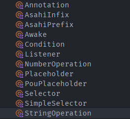
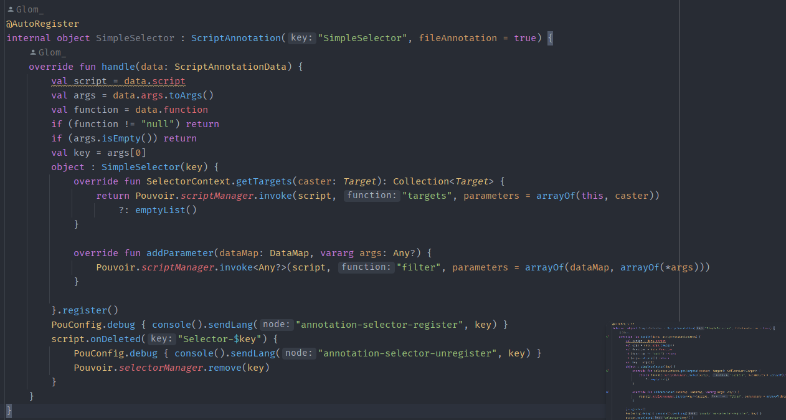

Pouvoir本身提供了许多注解

### 使用范例



```javascript
//注册监听器
//@Listener(-event org.bukkit.event.player.PlayerQuitEvent)
function onPlayerQuit(event) {
    const player = event.player
    event.setQuitMessage(("§8[§c§l-§8] §f" + player.name))
}

//注册前缀解释器
//              前缀解释器名称      命名空间
//@AsahiPrefix(-name example -namespace common)
function example(lexer) {
    const numberQuester = lexer.questDouble()
    return result(function (context) {
        const number = numberQuester.get(context)
        print(number)
        return number
    })
}

//注册注解

//@Annotation()
function exampleAnnotation(data) {
  //code
}

```

强大的Pouvoir甚至提供了一套完整的目标选择器，你可以通过JS随意拓展

```javascript

//这类注解一般都是一个注解占一个文件

//Selector(TEST)
function select(SelectorContext, caster) {}
function filter(SelectorContext, caster) {}
function parameter(dataMap, args) {}

//args一般都是array，js直接数组即可

//SimpleSelector(TEST)
function targets(SelectorContext, caster) {}
function filter(dataMap, args) {}

```

### 向外拓展


以上是注解的注册例子，当然你不仅可以使用kotlin和Java你还可以使用JS拓展

```javascript

//@Annotation()
function exampleAnnotation(data) {
  //code
}

```